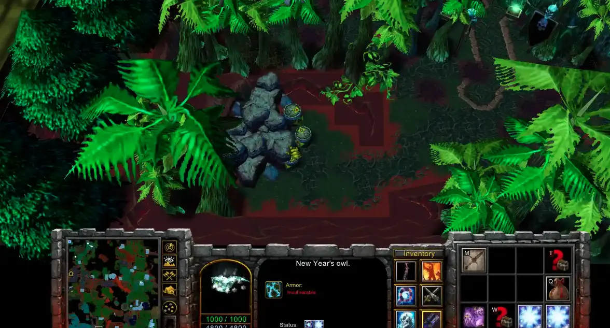
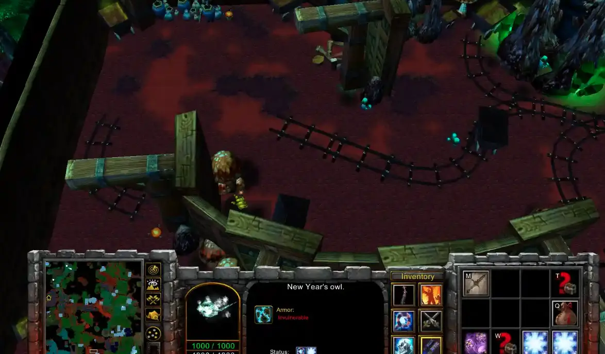
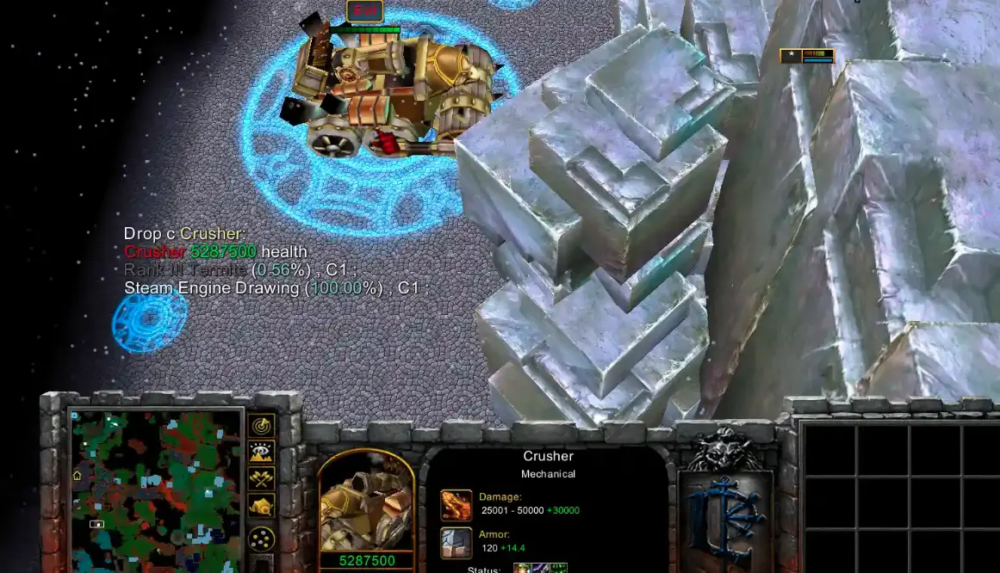

Located in archeological camp, this mine. You need torch and flint
flint can be bought in hydromancer shop in capital (bandage looking)
torch is found in abandoned mines (kobold), kill boss and walk close to torch, maybe attack it to get it

Once you exploded obstacles and entered the mines you need to find correct path to the boss.

