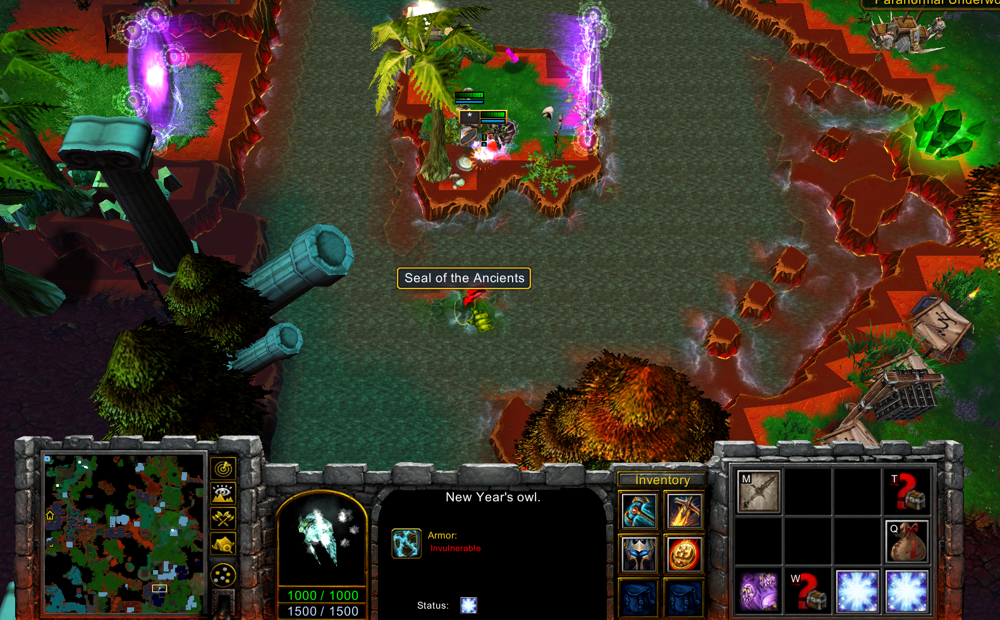
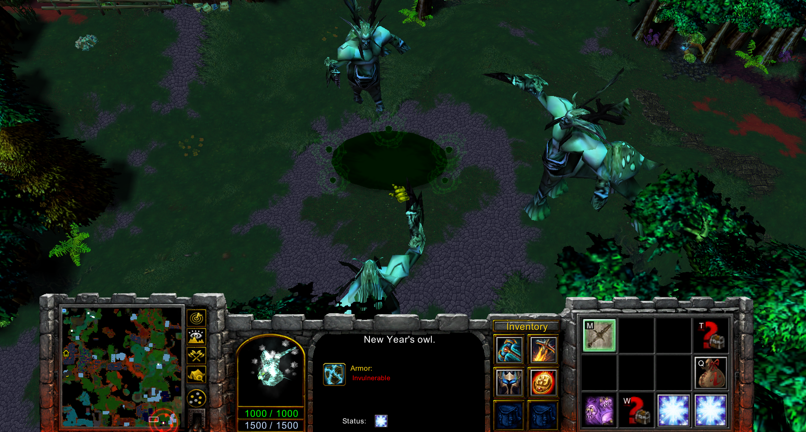
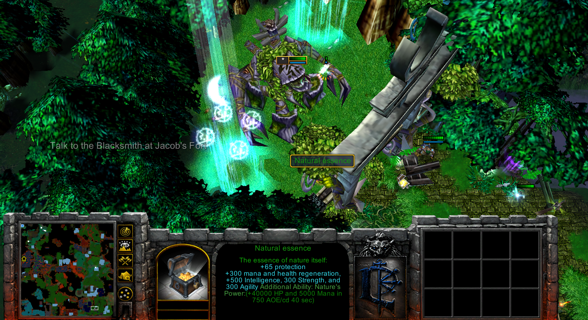

To start the quest you need to enter secret location that will teleport you to the tree of miracles, talk to him.
Go to capital and talk to sorceress. Kill 25 kobolds (abandoned mine) and 25 bears (gold mine).
You will get item that will unlock the doors to another tree. Go and talk. Not much will happen, so you need write secret code.
write 'save'
Tells you to find seal of the ancients, you need to do or take Jainas quest to acces the location.
Once you bring, it will open passage. Enter and kill the boss. After return the quest.
It will give you Natural essence item.

