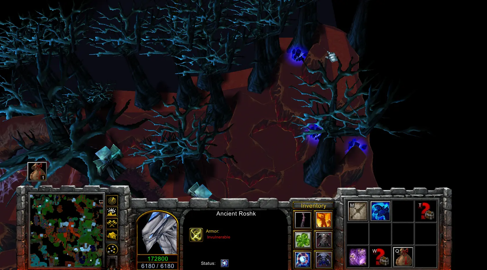

### Couriers
Kote = (halloween courier) Kote Part I + Kote Part II + Kote Part III + Kote Part IV - Armor Removal - 80 units, Increase your attack speed by 50%, 300% damage
Wisp = Forest Pet Part I (from Kobald at 8) + Forest Pet Part II (from Owl at 8) + Forest Pet Part III (from Royal Bandit at 8) - Forest Cover + 5% combat and movement speed. +2% critical strike and block chance.
Ancient Roshk = Kransparus - Ice pet that increases damage by 0.45 and reduces enemy attack speed by 23%.
Aramanchik = Aramanchik(Araman by 8) - Decreases defense by 30, Increases health recovery speed by 150 units
New Year's Owl = Santa's Soul + Santa's Ring + Santa's Staff + Santa's Cape - Increases the defense of nearby friendly troops by 35 units, health regeneration by 200 units and mana by 40 units
Mini Technoid = Mini Technoid (item) - Increases ranged damage by 100%, increases attack power by 100%
Chimera = Achievement for 8k kills - Increases combat speed by 20%, increases health regeneration speed by 500 units.
Djinn = 3 powerful buffs to choose from. Retrieve the lamp after killing the Blood Queen. Flying carpet in the wasteland.

Magic Key Chain
- Strange Key from Ashenvale Forest cage
- Bloody Key from hydromancer

Once you reach 160 lvl, nothing will give you exp except. Bosses that have stats (str,agi,int), and mobs 160 + (starting with 161).
Personally i only found them in underworld. To access underworld, you need kill sargeras and get his achiv. Only then you can access underworld both on normal or hell.
Bosses that i found to give exp at 160+ : Ice Horror, Admiral, Undertaker, Demon Arthas and Pernicious spirit (dremora garden quest)

Shandris is in 3rd purple portal in capital

If you kill cow with butchers axe you will get meat carcas.
It can be used for a quest to feed hungry hunter
It will later requrie more meat or fried meat.
with salt and spices  you can make fried carcas and feed him again

Ring daun recipe
Must be int hero
starts in circle/rife looking thing above dremora gardens
Next you need go to cat that is fairy tale forest, cloes to main story npc and whatnot.

tikva in one of the guardian rooms. say favorite pumpking when pressed

to access stone grove you need halloween event, and free the mentor (secret lab quest chain to open 1st and 2nd capital portals). After the npc is spirit of vengeance located where kellari is or tony quest is.

Scroll of power was from mini boss before 4th guardian.
In order for it to drop you need take quest from dremora guardians npc on a secret hill on the right.

